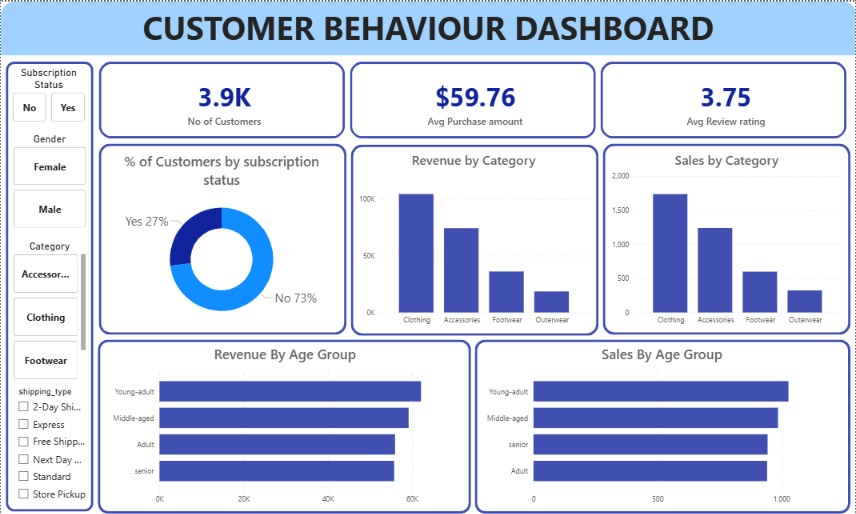

# Customer Shopping Behavior Analysis

An end-to-end Data Analytics project that analyzes customer shopping behavior using Python, PostgreSQL, SQL, and Power BI. The project focuses on identifying spending patterns, customer segments, product preferences, and subscription behavior to generate actionable business insights.

---

## Project Overview

Understanding customer behavior is critical for improving marketing strategies, increasing customer retention, and maximizing revenue.

In this project, transactional data from 3,900 customer purchases was analyzed to uncover key trends in purchasing behavior, customer demographics, product performance, and subscription patterns.

The project follows a complete analytics workflow:

- Data Cleaning & Preprocessing using Python
- Exploratory Data Analysis (EDA)
- Feature Engineering
- PostgreSQL Database Integration
- SQL-Based Business Analysis
- Interactive Dashboard Development in Power BI
- Business Recommendations

---

## Tech Stack

| Technology | Purpose |
|------------|----------|
| Python | Data Cleaning & Analysis |
| Pandas | Data Manipulation |
| PostgreSQL | Database Management |
| SQL | Business Query Analysis |
| Power BI | Dashboard Development |
| Jupyter Notebook | Development Environment |

---

## Dataset Information

| Metric | Value |
|---------|---------|
| Records | 3,900 |
| Features | 18 |
| Missing Values | 37 (Review Rating) |

### Key Features

- Customer ID
- Age
- Gender
- Item Purchased
- Category
- Purchase Amount
- Location
- Size
- Color
- Season
- Review Rating
- Subscription Status
- Shipping Type
- Discount Applied
- Promo Code Used
- Previous Purchases
- Payment Method
- Frequency of Purchases

---

## Data Cleaning & Preprocessing

The dataset underwent multiple preprocessing steps before analysis:

### Missing Value Handling

- Identified missing values in the Review Rating column.
- Imputed missing ratings using the median review rating of each product category.

### Data Standardization

- Renamed columns using snake_case naming conventions.
- Improved consistency and readability.

### Feature Engineering

Created additional features to improve analysis:

- `age_group`
- `purchase_frequency_days`

### Data Validation

- Checked for duplicate information.
- Verified consistency between discount and promotional code usage.
- Removed redundant columns.

---

## Database Integration

After preprocessing, the cleaned dataset was loaded into PostgreSQL for business-oriented SQL analysis.

Workflow:

```text
CSV Dataset
     ↓
Python Cleaning
     ↓
Feature Engineering
     ↓
PostgreSQL
     ↓
SQL Analysis
     ↓
Power BI Dashboard
```

---

## Business Questions Solved Using SQL

The following business problems were solved using PostgreSQL:

### 1. Revenue by Gender

Determine which gender contributes more revenue.

### 2. High-Spending Discount Users

Identify customers who use discounts but still spend above average.

### 3. Top 5 Products by Rating

Find products with the highest customer satisfaction.

### 4. Shipping Type Comparison

Compare spending patterns across shipping methods.

### 5. Subscribers vs Non-Subscribers

Analyze spending behavior and revenue contribution.

### 6. Discount-Dependent Products

Identify products that rely heavily on discounts.

### 7. Customer Segmentation

Segment customers into:

- New
- Returning
- Loyal

### 8. Top Products per Category

Find the most purchased products in each category.

### 9. Repeat Buyers & Subscription Analysis

Analyze subscription behavior among repeat customers.

### 10. Revenue by Age Group

Determine which age groups contribute the highest revenue.

---

## Key Insights

### Customer Revenue

- Male customers generated significantly higher revenue than female customers.

### Subscription Analysis

- 73% of customers are non-subscribers.
- Significant opportunity exists for subscription conversion campaigns.

### Customer Loyalty

- Loyal customers represent the majority of the customer base.

### Product Performance

- Several products rely heavily on discounts to drive sales.
- Top-rated products consistently receive strong customer feedback.

### Age Group Trends

- Young Adult customers generate the highest revenue contribution.

---

## Power BI Dashboard

The project dashboard provides an interactive view of customer behavior.

### Dashboard Features

- KPI Cards
  - Total Customers
  - Average Purchase Amount
  - Average Review Rating

- Revenue Analysis
  - Revenue by Category
  - Revenue by Age Group

- Sales Analysis
  - Sales by Category
  - Sales by Age Group

- Customer Insights
  - Subscription Distribution
  - Gender Analysis

- Interactive Filters
  - Subscription Status
  - Gender
  - Category
  - Shipping Type

## Dashboard Preview



---

## Business Recommendations

### Increase Subscription Adoption

Provide exclusive benefits and loyalty incentives to convert non-subscribers.

### Strengthen Loyalty Programs

Reward repeat customers to improve retention.

### Optimize Discount Strategy

Reduce over-dependence on discounts while maintaining sales volume.

### Product Positioning

Promote top-rated and high-performing products more aggressively.

### Targeted Marketing

Focus campaigns on high-revenue customer segments and age groups.

---

## Project Structure

```text
Customer-Shopping-Behavior-Analysis
│
├── Customer_Behaviour_Analysis.ipynb
├── Customer_Behaviour_Analysis_SQL_QUERIES.sql
├── Customer_Behaviour_Dashboard.pbix
├── customer_shopping_behavior.csv
├── Customer-Shopping-Behavior-Analysis.pptx
├── LICENSE
└── README.md
```

---

## Key Learnings

Through this project, I gained hands-on experience in:

- Data Cleaning & Preprocessing
- Exploratory Data Analysis
- Feature Engineering
- SQL Query Optimization
- PostgreSQL Database Integration
- Data Visualization
- Power BI Dashboard Development
- Business Insight Generation
- End-to-End Analytics Workflow

---
